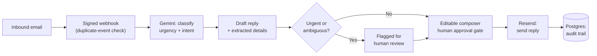

# Smart Inbox Management Agent
### An AI-assisted support inbox — classify, draft, approve, send, audit

Receives real email, classifies it, drafts a response, and sends approved replies with a durable delivery audit trail — AI makes the first-pass call, a human makes the final one.

**[Live demo →](https://inbox-management-agent.vercel.app/)**

## Why I built this

Support inboxes are where AI-assistance is genuinely useful and genuinely risky at the same time: fast triage matters, but an AI sending the wrong reply to a real customer is a worse outcome than no automation at all. I wanted to build the version of this that a real team could actually trust — which meant the interesting engineering wasn't "call the Gemini API," it was everything around that call: approval gates, audit trails, idempotency, and a safe way to demo it publicly without it being able to do anything real.

## How it's built

**Design** — Modeled messages, classifications, and reply drafts as linked Postgres tables via Prisma before writing UI, so the inbox dashboard, activity log, and drafts all read from one source of truth. Every reply and status change is written as a durable audit record, not just reflected in UI state.

**Build** — Integrated the Gemini API to classify urgency/intent and draft replies in real time, wired to Resend for inbound webhooks and outbound delivery. AI makes the first-pass judgment call on every message; the interface surfaces its confidence and extracted details, and a human approval gate sits in front of every send. Urgent or ambiguous messages are flagged and blocked from sending until an operator clears them.

**Improve** — Gemini's free tier hit a hard daily quota mid-testing (429 errors). Instead of retrying indefinitely, I added exponential backoff with a capped retry count. Then, since this needed to be safely demoable in public without risking real quota or real sends, I built a `DEMO_MODE` flag that gates every Gmail/email-sending route **at the API level, not the UI** — so a public demo can't accidentally trigger a live action. Also added signed webhook verification with duplicate-event protection, since inbound email webhooks can and do fire more than once for the same event.

## How it works



## Features

- Inbox dashboard with realistic sample data fallback
- Signed inbound email webhook with duplicate-event protection
- AI classification and extracted support details
- Editable reply composer with human approval gate
- Resend-backed outbound replies and delivery state tracking
- Reply and activity audit records in PostgreSQL
- Human review flag for urgent or sensitive messages

## Tech stack

- **Frontend:** Next.js (App Router), TypeScript, Tailwind CSS
- **Database:** PostgreSQL + Prisma
- **AI:** Gemini API (classification, draft generation)
- **Email:** Resend (inbound webhooks, outbound delivery)

## Running it locally

```bash
npm install
cp .env.example .env.local
npm run dev
```

Open `http://localhost:3000`.

**Required environment variables** (for real email):

| Variable | Purpose |
|---|---|
| `DATABASE_URL` | PostgreSQL connection string |
| `GEMINI_API_KEY` | Google AI API key |
| `RESEND_API_KEY` | Resend API key with sending access |
| `EMAIL_FROM` | Verified sender identity in Resend |
| `RESEND_WEBHOOK_SECRET` | Signing secret for the inbound webhook |

Optional (personal Gmail connector): `GOOGLE_CLIENT_ID`, `GOOGLE_CLIENT_SECRET`, `GOOGLE_REDIRECT_URI`, `SESSION_SECRET`.

For a public portfolio deployment, set `DEMO_MODE=true` — this serves sanitized seeded messages and disables live Gmail/email actions. Keep `DEMO_MODE=false` only in a private, authenticated environment.

**Resend webhook configuration:**
- Inbound: `https://your-domain.example/api/webhooks/email`
- Delivery events: `https://your-domain.example/api/webhooks/email-status`

Replies send via `POST /api/messages/[id]/send`. Urgent or ambiguous messages stay blocked until their human-review flag is cleared.

## Deployment

Built for Vercel. Add environment variables in the Vercel dashboard before deploying.

**Production checklist:**
- Add authentication and role-based access before exposing the dashboard publicly
- Run `npx prisma migrate deploy` during deployment after creating a migration
- Configure Resend webhook signing and a verified sending domain
- Add a background job for AI analysis if inbound volume can exceed webhook request limits
- Add monitoring for failed analysis, failed sends, bounces, and provider rate limits
- Test duplicate webhook delivery and retry behavior before launch
